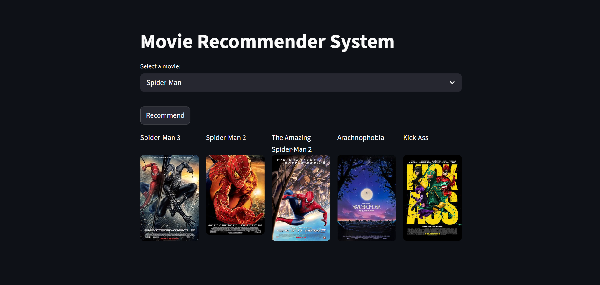

# 🎬 Movie Recommendation System

A **content-based movie recommendation system** that recommends the top 5 movies similar to a movie selected by the user.

## 📸 Application Preview



## 🌐 Live Demo

[Movie Recommendation System](YOUR_STREAMLIT_APP_URL)

## 🔄 How It Works

1. Load and preprocess the movie datasets.
2. Combine relevant movie information into a tags column.
3. Apply text preprocessing and stemming.
4. Convert the movie tags into numerical vectors using `CountVectorizer`.
5. Calculate cosine similarity between movie vectors.
6. For a selected movie, find the movies with the highest similarity scores.
7. Return the top 5 similar movies.
8. Fetch movie posters from the OMDb API and display them using Streamlit.

> **Note:** This project does not train a traditional supervised machine learning model. It uses a content-based recommendation approach based on text vectorization and cosine similarity.

## 🛠️ Technologies Used

- Python
- Pandas
- NumPy
- NLTK
- Scikit-learn
- Streamlit
- Requests
- Python-dotenv
- OMDb API


## 📂 Project Structure
The project contains the following main files and folders:

* **Dataset/** – Contains the raw and processed movie datasets and the generated files used by the recommendation system.

  * `tmdb_5000_movies.csv` - Contains the raw movie metadata, such as movie title, genres, keywords, and other movie information.
  * `tmdb_5000_credits.csv` - Contains cast and crew information for the movies.
  * `new_df.csv` - Contains the processed movie data with the required features combined into a tags column.
  * `movies.pkl` - Contains the processed movie data used by the Streamlit app.
  * `similarity.pkl` - Contains the precomputed cosine similarity matrix used to find similar movies.

* **images/** - Contains the screenshot of the Streamlit application used for the README.

* **1_data_preprocessing.ipynb** – Performs data loading, data inspection, data cleaning, merging of datasets, and creation of the processed movie dataset.

* **2_recommendation_engine.ipynb** – Performs text preprocessing and stemming, converts movie tags into numerical vectors using `CountVectorizer`, calculates cosine similarity, and saves the required pickle files.

* **app.py** – Contains the Streamlit application. It allows users to select a movie, displays the top 5 recommended movies, and fetches their posters using the OMDb API.

* **requirements.txt** – Contains the Python libraries required to run the project.

* **.gitignore** – Specifies files and folders that should not be uploaded to GitHub, such as the .env file and Jupyter Notebook checkpoint files.

* **README.md** – Provides an overview of the project, its workflow, technologies, installation steps, and other documentation.

## ▶️ Installation

### 1. Clone the repository

```bash
git clone <YOUR_GITHUB_REPOSITORY_URL>
cd movie_recommendation_system
```

### 2. Install dependencies

```bash
python -m pip install -r requirements.txt
```

### 3. Create the `.env` file

Create a `.env` file in the project root and add your OMDb API key:

```env
OMDB_API_KEY=your_api_key_here
```

Do **not** upload the `.env` file to GitHub. It is already included in `.gitignore`.

### 4. Run the Streamlit application

```bash
streamlit run app.py
```

The application will open in your browser.

## 🔑 OMDb API

The application uses the OMDb API to retrieve movie poster information.

You need an OMDb API key to use the poster-fetching functionality.


## 🎯 Project Objective

The objective of this project is to understand how a **content-based recommendation system** works using text features and similarity measures, and to deploy the recommendation system through a simple web application.
